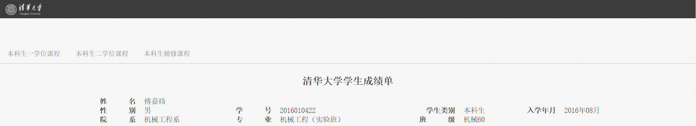

# 简介

这是一个用来计算你的GPA的repo。

目前只能把所有课程记下来，算出必限任的成绩。如何区分必限和任选，依然有待后续。

# 使用方法

1. 登录info，点击下图中红方框标出的按钮。

2. 进入如下图所示的页面。

3. 按`Ctrl+S`保存页面到与`parseGPA.py`同级的目录下，采用默认的文件名`清华大学学生课程学习记录表.html`即可。
4. 打开命令行，切换目录至与`parseGPA.py`同级的目录下。
5. 输入`python parseGPA.py`
6. 提示`请指定输出文件名`。此时可以指定输出的文件名，默认文件名为`GPA.xlsx`。如果直接回车，那么采用默认文件名。

# 输出文件

如果在上述步骤6中指定了输出的文件名，那么请到自己指定的文件中寻找信息。

如果没有指定，那么在`GPA.xlsx`中，会有两个worksheet。

1. `noPWEX` worksheet
   * 此worksheet中记录了可以计算成绩的课程，即非P非W非EX的课程，并计算了他们的对应的GPA。
   * C列中是学分，最下面一行是总学分
   * E列中是绩点
   * G列中是学分$\times$绩点，倒数第二行是总绩点GPS，最后一行是GPA
2. `all` worksheet
   * 此worksheet中记录了所有课程的信息